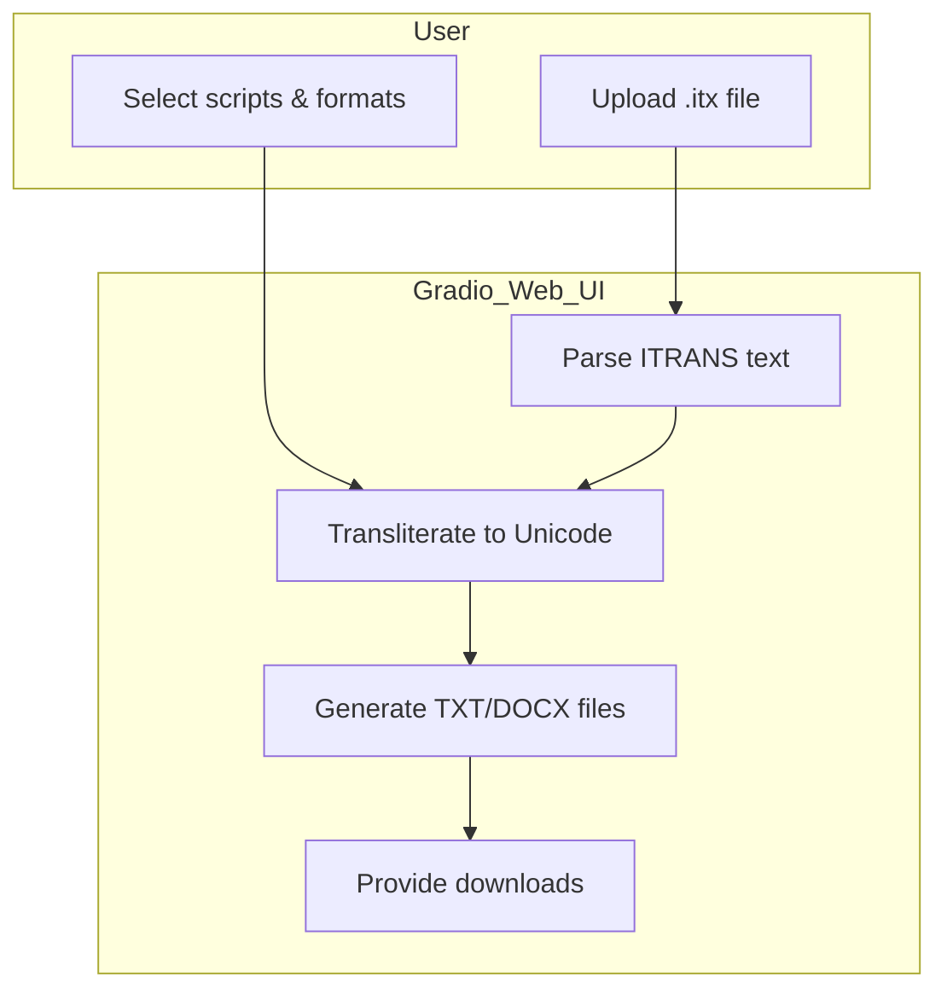
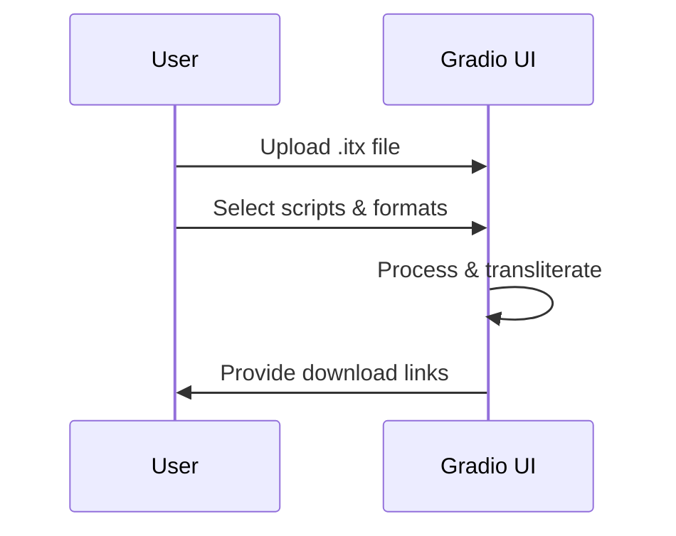
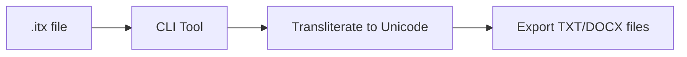

# ITRANS Indic Transliteration Toolkit

---

## About

A powerful, open-source toolkit to convert ITRANS-encoded Sanskrit and Indic language texts into Unicode across multiple Brahmic scripts. Includes:

- **Interactive Gradio Web UI**
- **Flexible CLI tool**
- **Multi-script, multi-format export**

---

## Features

- **Multi-script support:** Devanagari, Bengali, Gujarati, Gurmukhi, Kannada, Malayalam, Oriya, Tamil, Telugu
- **Multi-format export:** Unicode `.txt` and `.docx`
- **Batch processing:** Convert entire `.itx` documents
- **User-friendly:** No coding required for web UI
- **Open-source:** MIT licensed

---

## Architecture



---

## Usage

### 1. Install dependencies

```bash
pip install indic-transliteration python-docx gradio
```

---

## Gradio Web UI (Recommended)

### Launch the app

```bash
python gradio_app.py
```

### How to use

- Open the local URL (e.g., `http://127.0.0.1:7860`)
- **Upload** your `.itx` file
- **Select** target scripts (multi-select)
- **Choose** export formats (`txt`, `docx`, or both)
- **Download** the generated Unicode files



---

## CLI Tool

### Run the CLI

```bash
python transliterate_cli.py input.itx -f txt docx
```

### Options

- `input.itx`: Path to your ITRANS file
- `-f`: Export formats (choose one or both)

### What it does

- Converts `.itx` to Unicode `.txt` and/or `.docx` files
- Supports all major Indic scripts
- Saves output files in the current directory



---

## Why use this toolkit?

- **Save time:** Automate transliteration
- **Multi-script output:** Reach wider audiences
- **Professional output:** Ready for publishing
- **User-friendly:** Web UI or CLI options

---

## Repository Highlights

- `gradio_app.py` — Interactive web UI
- `transliterate_cli.py` — CLI tool
- `itrans_parser/` — Custom transliteration engine (optional)
- `.gitignore` — Clean repo without generated files
- `LICENSE` — MIT license

---

## Contributing

Pull requests, issues, and stars are welcome!

---

## License

MIT License © 2025 sourabh singh / theghostrat

---

## ⭐ If you find this project useful, please star it on GitHub and share with others!