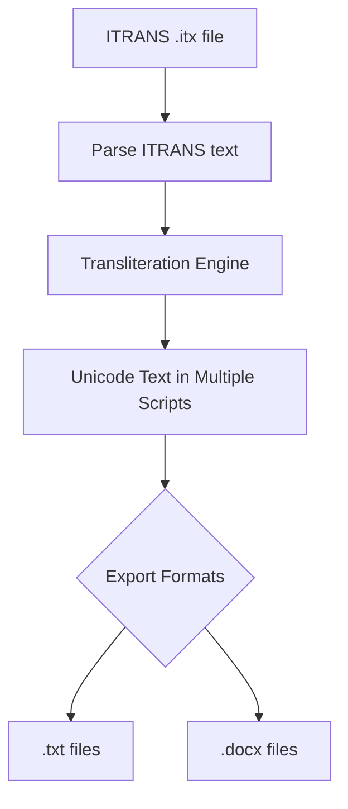

# ITRANS Indic Transliteration Toolkit

---

## About

A powerful, open-source toolkit to convert ITRANS-encoded Sanskrit and Indic language texts into Unicode across multiple Brahmic scripts. Includes:

- **Interactive Gradio Web UI**
- **Flexible CLI tool**
- **Multi-script, multi-format export**

---

## Features

- **Multi-script support:** Devanagari, Bengali, Gujarati, Gurmukhi, Kannada, Malayalam, Oriya, Tamil, Telugu
- **Multi-format export:** Unicode `.txt` and `.docx`
- **Batch processing:** Convert entire `.itx` documents
- **User-friendly:** No coding required for web UI
- **Open-source:** MIT licensed

---

## How it works



---

## Usage

### 1. Install dependencies

```bash
pip install -r requirements.txt
```

---

## Gradio Web UI (Recommended)

```bash
python gradio_app.py
```

- Upload `.itx` file
- Select scripts and formats
- Download Unicode files

---

## CLI Tool

```bash
python transliterate_cli.py input.itx -f txt docx
```

- Converts `.itx` to Unicode `.txt` and/or `.docx` files
- Supports all major Indic scripts

---

## Repository Highlights

- `gradio_app.py` — Interactive web UI
- `transliterate_cli.py` — CLI tool
- `itrans_parser/` — Custom transliteration engine (optional)
- `.gitignore` — Clean repo without generated files
- `LICENSE` — MIT license

---

## Contributing

Pull requests, issues, and stars are welcome!

---

## License

MIT License © 2025 sourabh singh / theghostrat

---

## ⭐ If you find this project useful, please star it on GitHub and share with others!